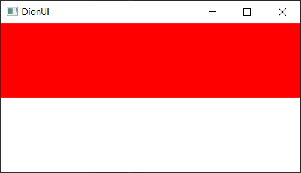

# dion-ui

dion - решение, позволяющее писать нативные desktop приложения на Go под ОС Windows
без сторонних зависимостей. В качестве графических api используется DirectX, DirectWrite.
Библиотека состоит из множества модулей, каждый из которых имеет подробное описание.
Ключевой особенностью dion является возможность отделять разметку окна и стилей от логики приложения,
реализуя frontend часть в отдельном xml файле со специальным синтаксисом, но
никто не запрещает использовать виджеты напрямую в коде. Смотрите скорее примеры, приятного
пользования :)

## Почему именно dion?

- Библиотека создана на чистом Go, без использования cgo
- Маленький размер исполняемого файла (в среднем ~3MB)
- Возможность использовать xml для разметки и стилизации интерфейса
- Простой api позволяет легко дополнять и изменять движок dion
- Поддержка автообновления разметки из xml файла (для визуального создания интерфейса)
- Полная поддержка unicode

## Установка

Откройте терминал и напишите:
```
go get -u github.com/bezrazli4n0/dion-ui
```

## Пример

window.xml:
```xml
<Window
    title="DionUI"
    width="400"
    height="200"
    x="0"
    y="0"
    autoclose="true"
    backgroundColor="255, 255, 255"
    onLMouseUp="leftCallback"
    onRMouseUp="rightCallback"
    onResize="resizeCallback">
    <Canvas>
        <FillRectangle x="0" y="0" width="100%" height="50%" color="255, 0, 0"/>
    </Canvas>
</Window>
```
window.go
```go
package main

import (
	"github.com/bezrazli4n0/dion-ui/pkg/app"
)

func main() {
	dion.Init()

	wndState, _ := dion.NewWindowEngine(nil)
	wndState.LoadUIFromFile("window.xml")

	dion.Run()
}
```

<p align="center"></p>

* Больше примеров можно найти в папке [examples](examples)